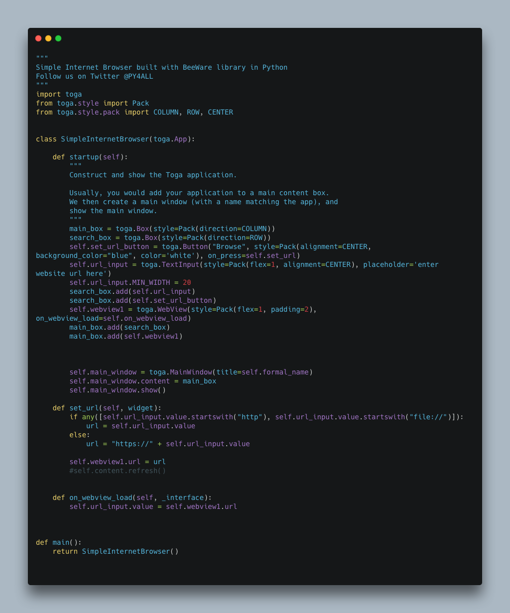

# Simple Internet Browser
Simple Internet Browser built with BeeWare library in Python



## This is Simple Internet Browser.

#### The modules Used to make this script are:-

        -toga
        -Briefcase

This is a GUI based python script.

## Install
```
- Download this repository on local machine.
- Extract Binary_Quiz repository on local machine and open Binary_Quiz folder
- Follow the tutorial from BeeWare documentation to setup the environment:
  https://docs.beeware.org/en/latest/tutorial/tutorial-0.html
- Replace app.py file with the one from this repository
- Then run this command:
  > briefcase dev
```


Windows


Linux


MacOS


Anroid


IOS

